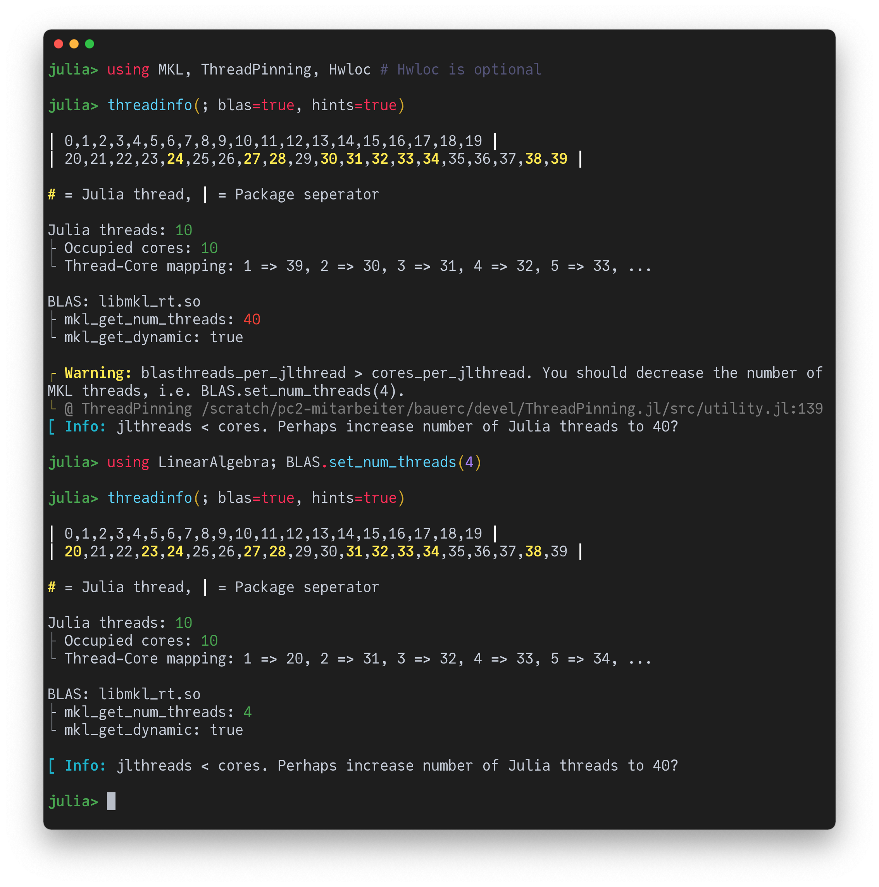

# [Autochecking BLAS Thread Settings](@id ex_blas)

If one runs a multithreaded Julia code that, on each thread, performs linear algebra operations (BLAS/LAPACK calls) one can easily run into performance issues due to an oversubscription of cores by Julia and BLAS threads (see [here](@ref BLAS) for a more thorough discussion). Fortunately, ThreadPinning.jl provides some (basic) autochecking functionality that highlights potential problems and suggests improvements.

Concretely, you can provide the keyword argument `blas=true` to [`threadinfo`](@ref). This will show some of your BLAS settings and will color-indicate whether they are likely to be ok (green) or suboptimal (red). If you also provide `hints=true`, ThreadPinning.jl will try to provide concrete notes and warnings that (hopefully) help you to tune your settings.

## OpenBLAS

## Intel MKL

